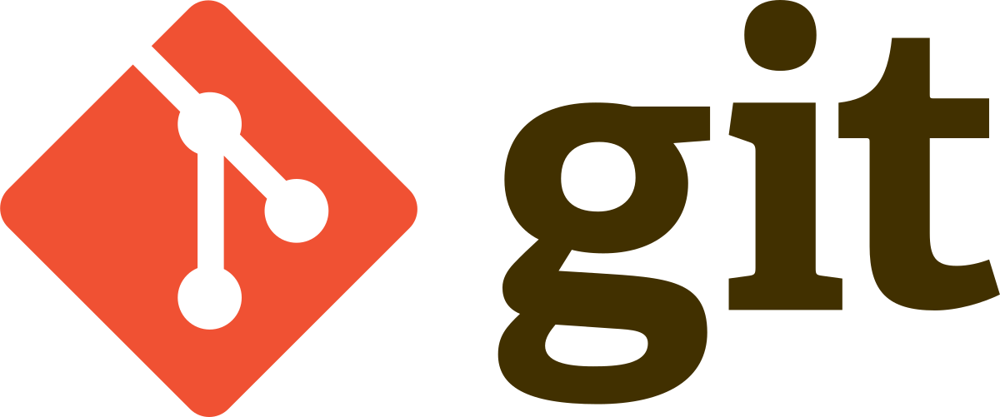
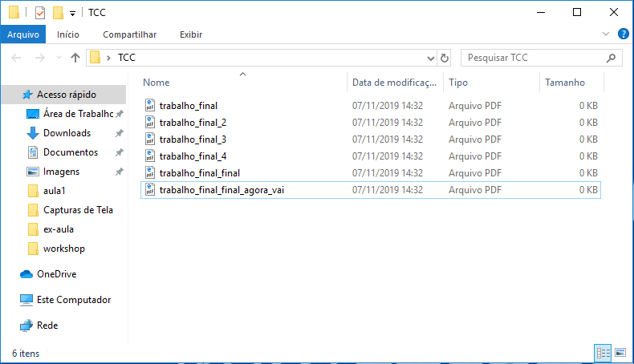
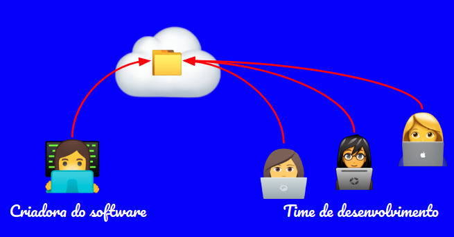
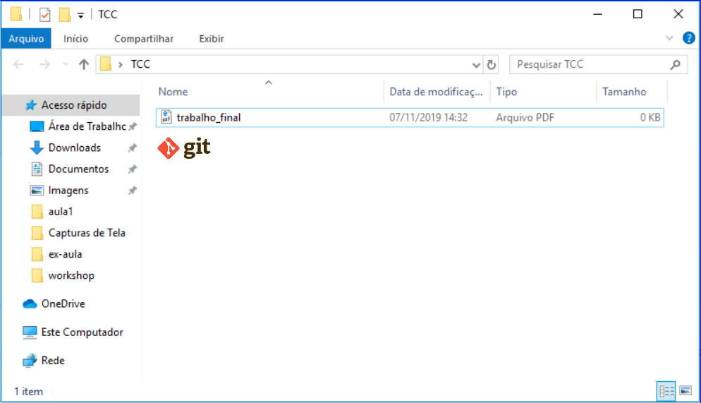

[<- Voltar para o início](../README.md)

# Git

## Índice
- [O que é git ?](#o-que-é-git-)
- [Por que é importante ?](#por-que-é-importante-)
- [Instalação](#instalação)
- [Git Bash](#git-bash)

### O que é git ?

[Git](https://git-scm.com/) é um sistema de controle de versões distribuído, usado principalmente no desenvolvimento de software para registrar o histórico de edições dos arquivos.

Foi desenvolvido por Linus Torvalds (criador do Linux)e é um [software livre](https://pt.wikipedia.org/wiki/Software_livre).

Com o Git podemos desenvolver projetos colaborativos, com diversas pessoas trabalhando simultaneamente no mesmo código sem riscos de perdermos o que fizemos, com a lógica bem parecida com a do Google Drive.

O Git guarda um histórico de tudo que foi alterado nos arquivos ao longo do tempo, além de mostrar quem foi o autor da mudança, fazendo que a gente consiga restaurar versões anteriores.

### Por que é importante ?

**Sabe quando a gente precisa salvar versões de um projeto até chegar na versão de entrega ?**

Quando trabalhamos em equipe ou necessitamos de uma organização melhor, fica muito difícil trabalhar com o modelo acima, e é por isso que utilizamos o git:

Com ele, ao invés de criarmos arquivos e versioná-los pelo nome, passamos a versionar pelo histórico do git:

Então as vantagens do git são:
- Organização + histórico das modificações: O git cria uma timeline com tudo que aconteceu desde o início do projeto com informações detalhadas. Tudo que foi adicionado, removido, modificado(**arquivos**), **quando**, **quem** foi o autor e o motivo da alteração(**mensagem do commit**).
- Projetos com várias pessoas: Evita o "final_valendo_valendo2_oficial_agora_vai" o trabalho em equipe (entender o que foi feito, onde parou, quem fez).
- Busca de informações: Facilita um colaborador novo a se informar do que foi trabalhado naquele projeto.
- Segurança: Se algo der errado, voce pode resgatar uma versão anterior, além de ter o seu projeto salvo em um lugar seguro.

### Instalação

- Para Linux/Unix: https://git-scm.com/download/linux
- Para Mac: https://git-scm.com/download/mac
- Para Windows: https://git-scm.com/download/win

#### Instruções Windows:

Instalar o arquivo .exe baixado:

Abrir o git bash:

### Git bash

É um software para utilizar as linhas de comando do git além de alguns outros comandos unix, necessário principalmente no Windows, já que inicialmente o git foi desenvolvido para linux

### Material de apoio 

🎬 [Video de Apoio](https://www.youtube.com/watch?v=vkpxf57cngo)

<u>Importante!!!</u> Para quem possui **Linux** ou **MacOs** o git já vem instalado por padrão.

Para maiores informações sobre como configurar o git no mac, entre na parte de [config do mac](./configuracoes-mac.md).

## Vamos praticar?
- [ ] [Exercicio 1](../exercicios/01-exercicio-bash/exercicio1.md)

[<- Sobre Linhas de Comando](./01-sobre-linha-de-comando.md) | [Sobre linha de comando no git ->](./03-sobre-linhas-de-comando-git.md)