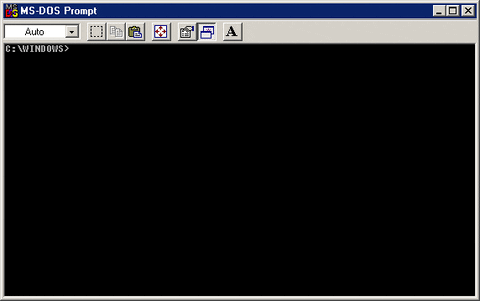

[<- Voltar para o início](../README.md)

# Linha de comando no Git

  ### **Comandos**
  Vamos ver alguns comandos para utilizar o [Github](https://github.com/) a partir do `Git`

  Comando                         | Descrição
--------------------------------|-------------------------------------------------------
git add nome-do-arquivo         | adiciona um arquivo modificado ao stagging (área temporária) 
git add .                       | adiciona todos os arquivos modificados ao stagging (área temporária) 
git status                      | mostra os status dos arquivos modificados
git commit -m "mensagem"        | cria um commit
git pull                        | puxa as atualizações mais recente (remoto -> local)
git push                        | envia as atualizações mais recentes (local -> remoto)
git remote add origin nome-da-branch   | faz um link entre seu repositório local com o remoto 
git checkout -- nome-arquivo    | descarta as alterações locais do arquivo informado
git checkout -b nome-da-branch  | cria uma branch a partir da atual
git checkout nome-da-branch     | troca de branch
git merge nome-da-branch        | mescla a branch passada no parâmetro com a atual
git remote -v                   | mostra as URLs para onde o git está apontando
git log                         | mostra o histórico de commits, com data, hora, mensagem e autora (caso fique presa nessa lista, aperte "q" para sair)
git branch                      | lista todas as branchs locais
git diff                        | mostra no terminal a diferença entre os arquivos editados localmente

  **Alguns conceitos básicos que vamos usar a partir de hoje no GitHub**

  * **Repositório**: espaço digital aonde o seu projeto vai ser salvo. No seu computador ele é a pasta aonde o seu projeto está salvo.

  * **Commit**: controle de versão (histórico) daquele arquivo e cria uma etiqueta para facilitar o entendimento do que foi salvo naquele momento.

  * **Pull**: serve para se comunicar entre a sua máquina e o repositório remoto. Esse comando faz uma cópia do repositório remoto e baixa ele para a sua máquina.

  * **Push**: serve para se comunicar entre a sua máquina e o repositório remoto. Esse comando faz uma cópia do repositório local e envia ele para o repositório remoto.

  * **Clone**: faz exatamente o que ele sugere: uma cópia exata do arquivo, que você vai baixar do repositório remoto para a sua máquina.

  * **Branch**: permite que cada usuário tenha o seu "galho" dentro de um projeto de maneira independente. Ela é uma parte muito útil no desenvolvimento em um projeto coletivo.

  * **Merge**: unifica diferentes branches

  * **Fork**: cria uma cópia de um projeto para o seu GitHub

  * **Pull Request(PR)**: solicitação de dar merge da sua branch em um projeto de outra pessoa

  ### **Commits semânticos**

  **Commit semântico** (ou *`conventional commit`*) é a prática de *PADRONIZAÇÃO* das mensagens de `commits` dentro de um projeto de desenvolvimento de software.

  Uilizando regras simples e claras, que apesar de inroduzirem uma pequena carga a mais de trabalho, vai contribuir para que seja reduziado o tempo gasto em compreender como e por que algo foi feio em uma alteteração ou correção posterior do código.

  Na rotina de `dev` solo, não parece que existem muitos benefícios, porém, com a introdução de um time que trabalha simultaneamente no mesmo projeto em um mesmo repositório centralizado, há um aumento da agilidade de compreensão do que seus pares desenvolveram e corrigiram no código já existente.

  Algumas vantagens dos `commits semânticos` são:
   - Possibilitar a adoção de processos automatizados, o que resulta em uma documentação estruturada e consistente
  - Determinar automaticamente um aumento de versionamento semântico (com base nos tipos de commits)
  - Comunicar a natureza das mudanças para colegas de equipe, o público e outras partes interessadas
  - Facilitar a contribuição de outras pessoas em seus projetos, permitindo que eles explorem um histórico de commits mais estruturado
  - O Conventional Commit encoraja a se realizar mais commits de tipos específicos, por exemplo correções
  - A flexibilidade do `Conventional Commits` permite que sua equipe crie seus próprios tipos e altere ao longo do tempo

## Vamos praticar?
- [ ] Exercicio 1

[<- Sobre Linhas de Comando](./01-sobre-linha-de-comando.md) | [Sobre linha de comando no git ->](./03-sobre-linhas-de-comando-git.md)