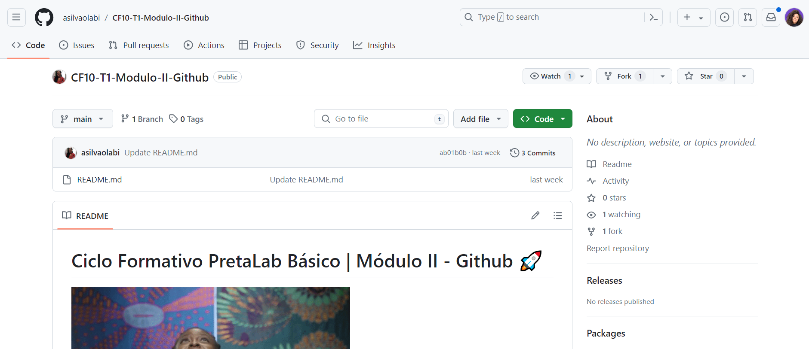
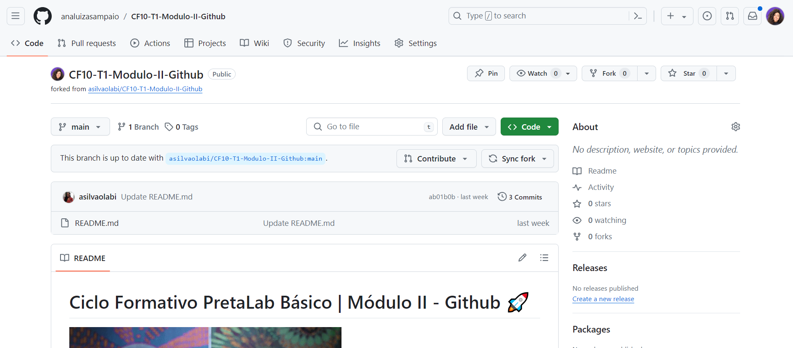

[<- Voltar para o início](../README.md)

# Fork 

> Esse material foi traduzido do material <a href="https://help.github.com/en/enterprise/2.13/user/articles/fork-a-repo" target="_blank">Fork a Repo</a>

## Índice
- [O que é fork e as diferenças com clone](#o-que-é-fork-e-as-diferenças-com-clone)
- [Por que é importante ?](#por-que-é-importante-)
- [Como fazer](#como-fazer)
- [Fluxo de trabalho com repositório fork](#fluxo-de-trabalho-com-repositório-fork)

### O que é fork e as diferenças com clone

Fork é uma cópia do repositório, porém diferente de um git clone ele realmente duplica o repositório na sua conta, fazendo com que existam dois repositórios online, o original e o que passou por fork.

### Por que é importante ?

Fazer fork de um repositório te permite fazer mudanças livremente sem afetar o projeto original.
Serve para:
- Propor mudanças em projetos que você não é contribuidor/projetos de outra pessoa
- Usar o projeto de outra pessoa como ponto de partida para sua própria ideia

### Como fazer

Para fazer o fork é bem simples, vamos utilizar esse repositorio para mostrar:

- Ao acessar a página no github do repositório <a href="https://github.com/analuizasampaio/CF10-T2-Modulo-II-Github" target="_blank">CF10-T2-Modulo-II-Github</a> veremos o botão fork no lado direito da tela:


Para iniciar o fork é só clicar nesse botão e aparecerá essa janela perguntando onde devemos salvar o repositório com fork:


Aqui devemos selecionar o nosso usuário logado no github, logo em seguida ele já nos redirecionará para onde o repositório 'forkado' está e pode aparecer essa tela de carregamento

Aí podemos ver como o repositório com fork fica diferente do repositorio original:
- <a href="https://github.com/analuizasampaio/CF10-T2-Modulo-II-Github" target="_blank">Repositorio original</a>

----
- <a href="https://github.com/analuizasampaio/CF10-T1-Modulo-II-Github" target="_blank">Repositorio com fork</a>


### Fluxo de trabalho com repositório fork

- Para fazermos o processo de solicitação de mudanças utilizando um repositorio com fork, começamos igual: Fazendo clone. Porém dessa vez faremos clone do repositório gerado a partir do fork:


Selecione a pasta que você quer clonar seu repositório com fork e abra o terminal/git bash.
**Obs**: Como o repositorio com fork gerará um projeto com o mesmo nome de pasta do original, o ideal é clonar em uma pasta diferente que não exista o clone do repositorio original, pois caso você tente clonar o repositorio com fork na mesma pasta que existe o projeto original gerará esse erro:
```
fatal: destination path 'CF10-T2-Modulo-II-Github' already exists and is not an empty directory.
```

Depois de escolher a pasta onde quer clonar, abra o git bash/terminal nela e execute o clone,

#### Vamos praticar?
- [ ] [Exercicio 7](/exercicios/07-exercicio-fork/exercicio7.md)
- [ ] [Exercicio 8](/exercicios/08-exercicio-pull-upstream/exercicio8.md)

[<- Sobre Github](./03-sobre-linhas-de-comando-git.md) | [Atividade para casa ->](../exercicios/09-exercicio-da-semana/exercicio-da-semana.md)