[<- Início](../README.md)

# Fork
> Esse material foi traduzido do material <a href="https://help.github.com/en/enterprise/2.13/user/articles/fork-a-repo" target="_blank">Fork a Repo</a>


## Índice
- [O que é fork e as diferenças com clone](#o-que-é-fork-e-as-diferenças-com-clone)
- [Por que é importante ?](#por-que-é-importante-)
- [Como fazer](#como-fazer)
- [Fluxo de trabalho com repositório fork](#fluxo-de-trabalho-com-repositório-fork)
- [Como manter o projeto fork atualizado](#como-manter-o-projeto-fork-atualizado)


### O que é fork e as diferenças com clone

Fork é uma cópia do repositório, porém diferente de um git clone ele realmente duplica o repositório na sua conta, fazendo com que existam dois repositórios online, o original e o que passou por fork.

### Por que é importante ?

Fazer fork de um repositório te permite fazer mudanças livremente sem afetar o projeto original.
Serve para:
- Propor mudanças em projetos que você não é contribuidor/projetos de outra pessoa
- Usar o projeto de outra pessoa como ponto de partida para sua própria ideia

### Como fazer

Para fazer o fork é bem simples, vamos utilizar esse repositorio para mostrar:

- Ao acessar a página no github do repositório <a href="https://github.com/reprograma/On5-git-e-github" target="_blank">On5-git-e-gihub</a> veremos o botão fork no lado direito da tela:

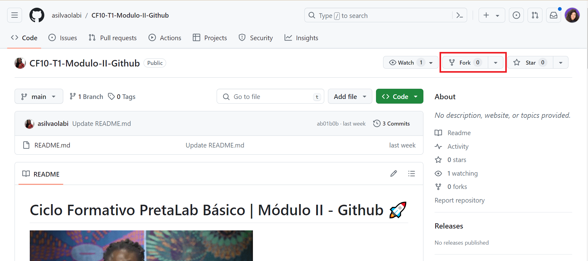

Para iniciar o fork é só clicar nesse botão e aparecerá essa janela perguntando onde devemos salvar o repositório com fork:

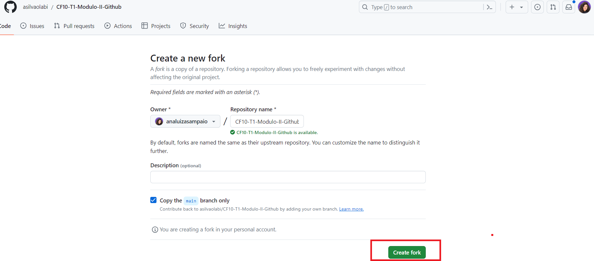

Aqui devemos selecionar o nosso usuário logado no github, logo em seguida ele já nos redirecionará para onde o repositório 'forkado' está e pode aparecer essa tela de carregamento:

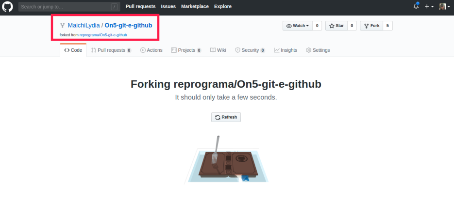
fork

Aí podemos ver como o repositório com fork fica diferente do repositorio original:
- <a href="https://github.com/reprograma/On5-git-e-github" target="_blank">Repositorio original</a>
- <a href="https://github.com/MaichiLydia/On5-git-e-github" target="_blank">Repositorio com fork</a>
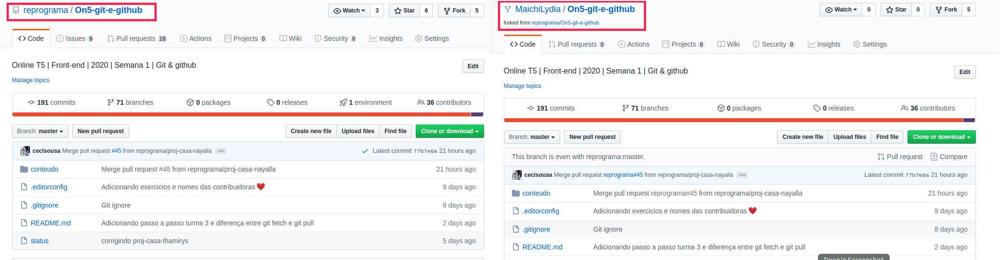

### Fluxo de trabalho com repositório fork

- Para fazermos o processo de solicitação de mudanças utilizando um repositorio com fork, começamos igual: Fazendo clone. Porém dessa vez faremos clone do repositório gerado a partir do fork:

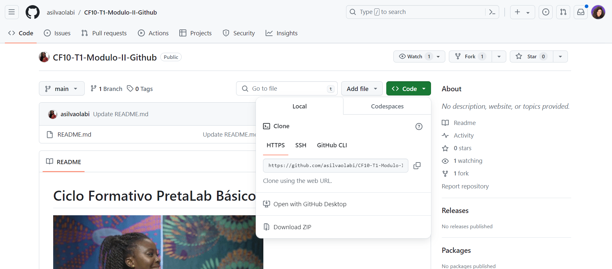tela de Comparing change

Selecione a pasta que você quer clonar seu repositório com fork e abra o terminal/git bash.
**Obs**: Como o repositorio com fork gerará um projeto com o mesmo nome de pasta do original, o ideal é clonar em uma pasta diferente que não exista o clone do repositorio original, pois caso você tente clonar o repositorio com fork na mesma pasta que existe o projeto original gerará esse erro:
```
fatal: destination path 'On5-git-e-github' already exists and is not an empty directory.
```

Depois de escolher a pasta onde quer clonar, abra o git bash/terminal nela e execute o clone:

```
git clone https://github.com/{seu-usuario}/On5-git-e-github.git
```
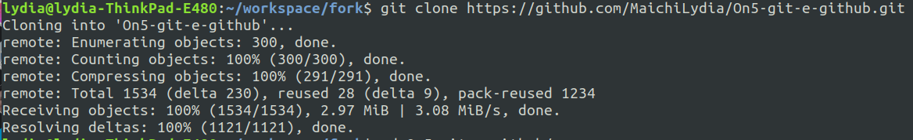

Após isso:
```
cd On5-git-e-github/
git remote -v
```
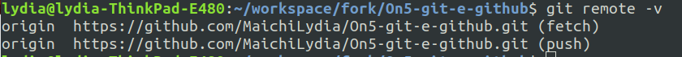

Para praticar podemos criar uma branch:
```
git checkout -b fork-exercicio-seuNome
```
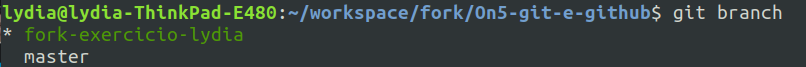

Abra o vscode e modifique o arquivo
index.html dentro da pasta `conteudo/exercicios/9-exercicio-fork`
- Alterar o código colocando `seu login GitHub` na `<td>` abaixo do seu nome.
  Exemplo:

**Antes:**
```
  <tr>
    <td>Lydia Rodrigues</td>
    <td>Seu usuario github</td>
  </tr>
```

**Depois**
```
  <tr>
    <td>Lydia Rodrigues</td>
    <td>MaichiLydia</td>
  </tr>
```
- Salve a alteração e verifique no navegador se está correto.
- Volte para o Git Bash dentro dessa pasta.
- `git status`: verifique o status do repositório atual.
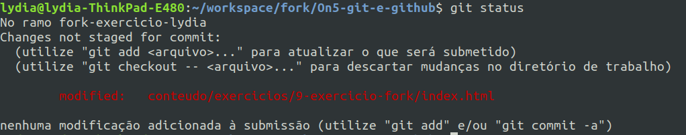

- `git diff`: verique o que foi modificado.
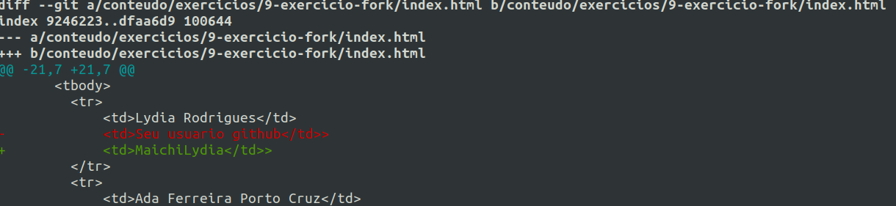

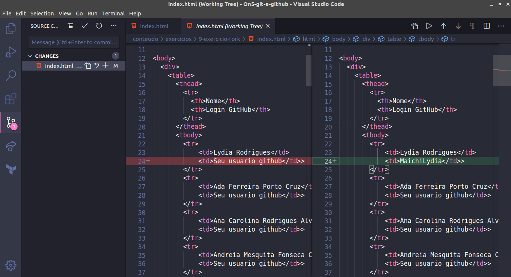

```
git remote -v
```


- `git push origin fork-exercicio-seuNome`
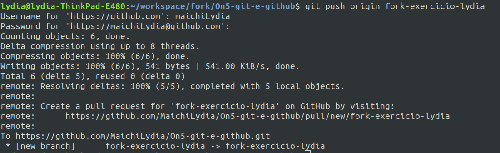

Ao ir no repositorio online que passou por fork, faremos o mesmo processo de pull request.
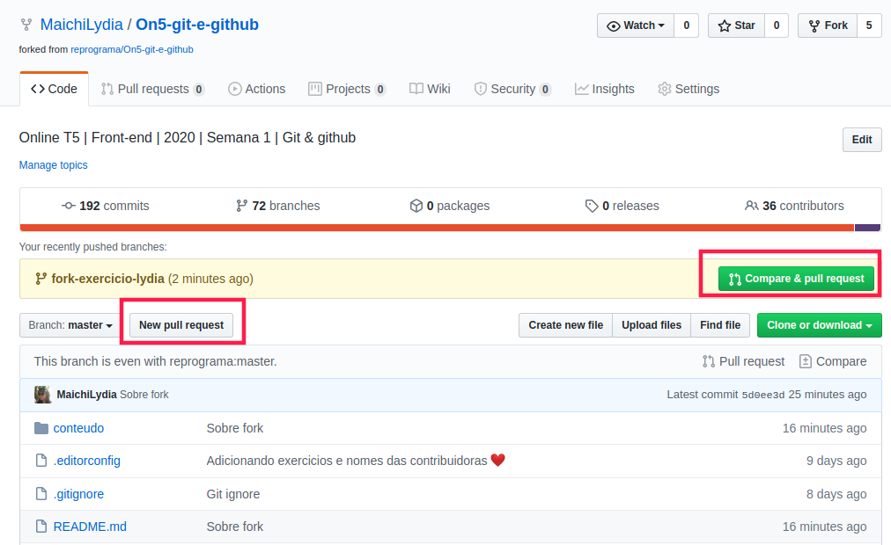

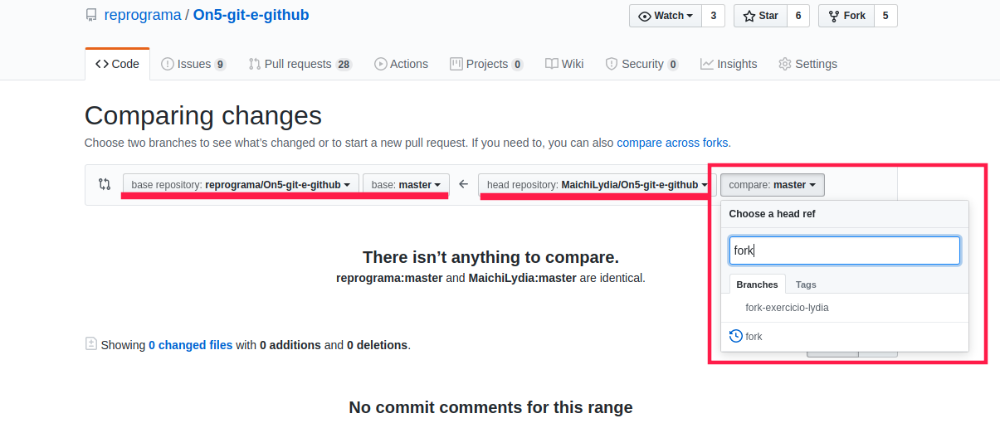

Aqui é um pouco diferente do que vimos antes, pois há a opção de base repository, como vamos enviar a mudança para o repositorio original, devemos manter selecionado o `reprograma/On5-git-e-github` com a base em `master` e no head repository devemos selecionar o com nosso usuario `seuUsuario/On5-git-e-github` compare `fork-exercicio-seuNome`

**Obs**: Caso quiser mandar o pull request pro seu repositorio que passou por fork, é só mudar o base repository para `seuUsuario/On5-git-e-github`

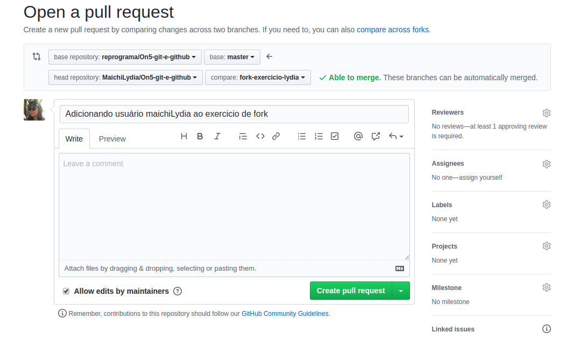

Após isso o seu merge estará criado e passara pelo review como dos outros exercicios :) !

#### Como manter o projeto fork atualizado

Para pegar as modificações do repositorio original deveremos fazer uma configuração adicional no projeto que passou por fork.
Vá na pasta onde você clonou o repositório com fork e abra o git bash nele.
Ao fazermos `git remote -v` novamente:


Veremos apenas o origin.
Agora deveremos criar um remote para o repositorio original também, assim poderemos saber quando ocorreu modificações nele, para isso, nesse exercicio faremos:
```
git remote add upstream https://github.com/reprograma/On5-git-e-github.git
```
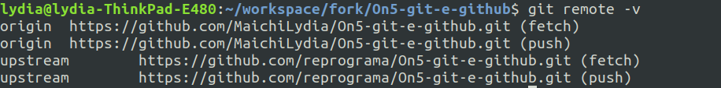

Agora para atualizar a master do projeto copiado(fork) com o repositorio online devemos:
- `git checkout master`
- `git pull upstream master`

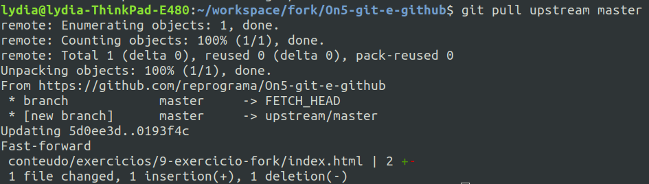

[<- Sobre linha de comando](sobre-linha-de-comando.md) |