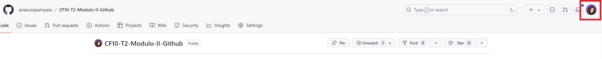
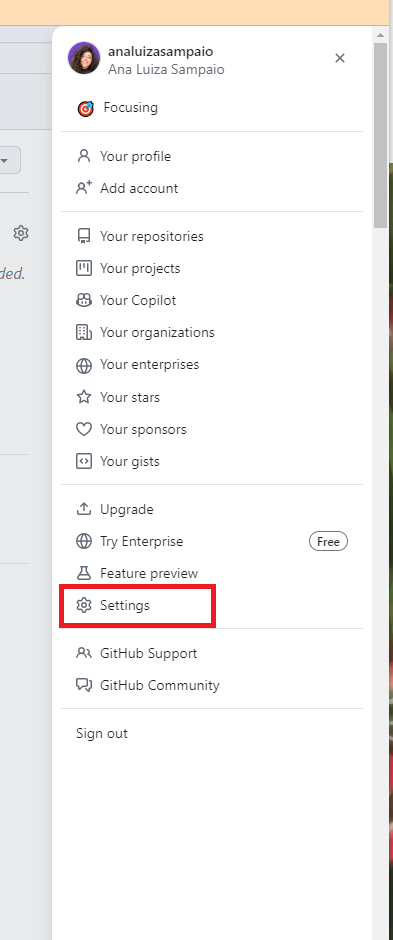
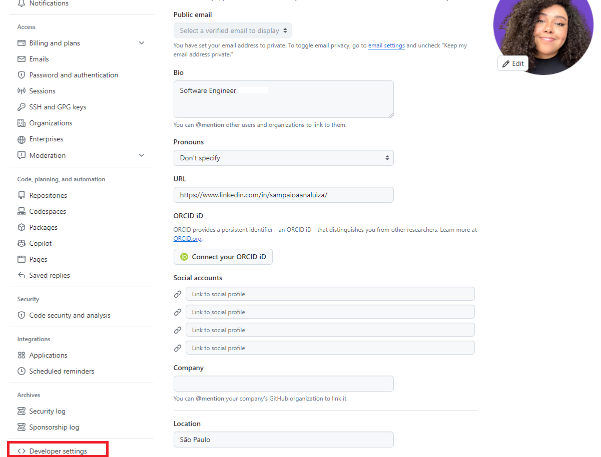
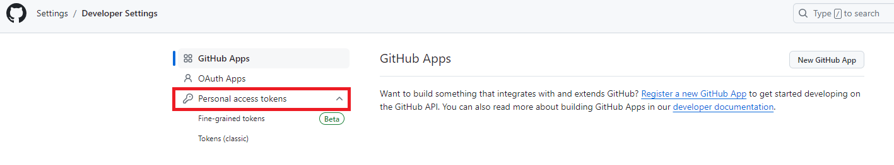
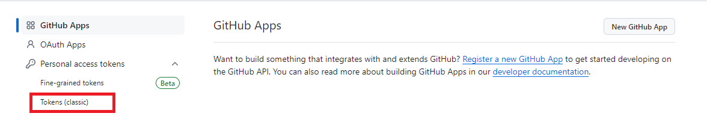
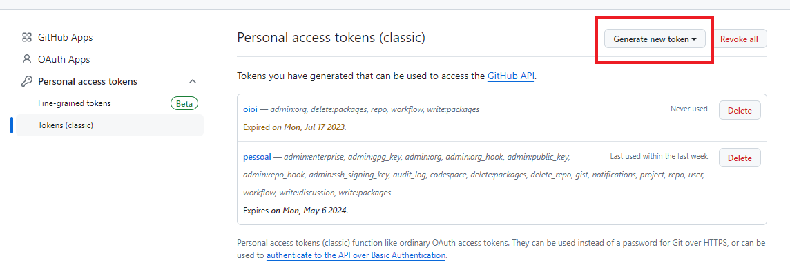
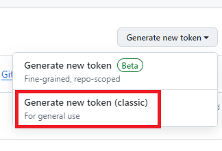
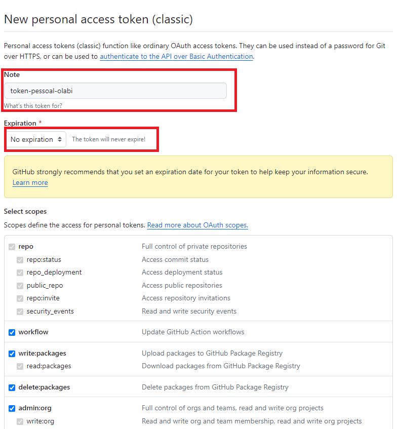
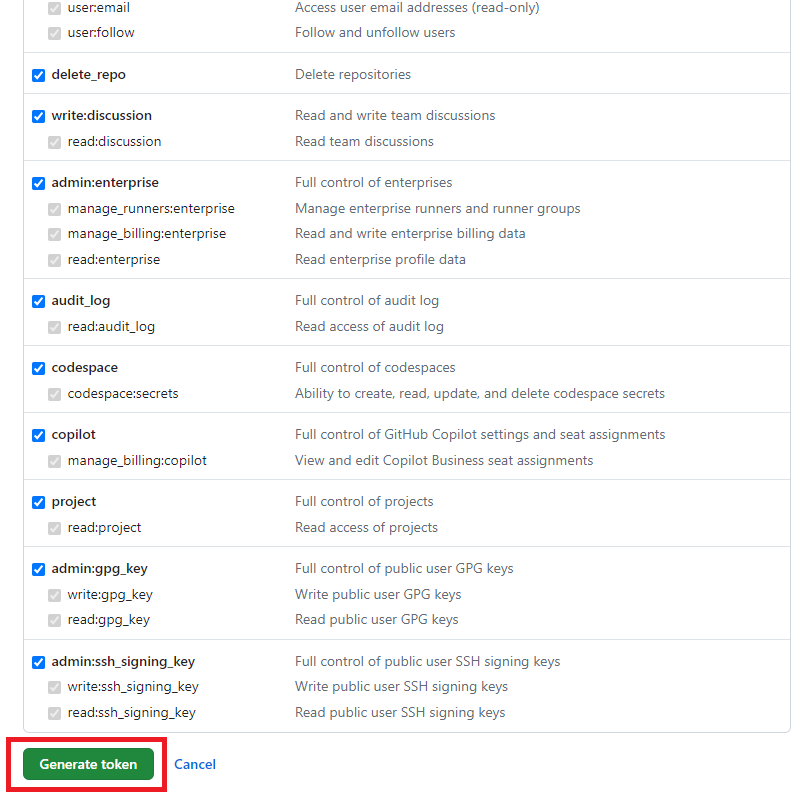
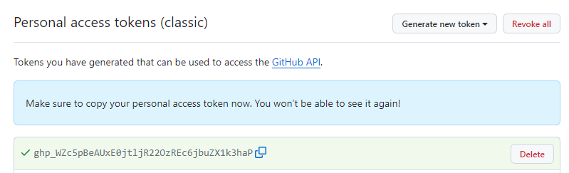

[<- Início](../README.md)

# Erro de autenticação do GitHub no GitBash

## Índice
- [Descrição do problema](#descrição-do-problema)
- [Motivo](#motivo)
- [Solução](#solução)
- [Material de Apoio](#material-de-apoio)

### Descrição do problema
Ao tentar configurar sua conta do Github no GitBash pode acontecer de você receber um erro de autenticação, onde ele diz que o login por senha não é mais suportado e que devemos utilizar o token de acesso pessoal.

Você deve ter recebido alguma mensagem parecida com essa:
```bash
Logon failed, use ctrl+c to cancel basic credential prompt.
remote: Support for password authentication was removed on August 13, 2021. Please use a personal access token instead.
remote: Please see https://github.blog/2020-12-15-token-authentication-requirements-for-git-operations/ for more information.
fatal: unable to access ‘<repositório Git>’: The request URL returned error: 403 
```

### Motivo
Isso acontece porque o Github colocou como obrigatória a autentificação por dois fatores. Isso garante a maior segurança da sua conta e projetos. Depois dessa configuração você terá seu login e senha básicos mas também tokens de acesso que podem ser configurados de acordo com a necessidade do seu projeto.

Esses tokens permitem que aplicativos e scripts realizem operações na conta do usuário, como criar repositórios, gerenciar problemas, fazer commit de código e acessar outros recursos por meio da API do GitHub.

Por isso devemos configurar nosso token na nossa conta do github. Essa dupla autentificação também pode ser usada por aparelhos terceiros com o aplicativo logado.

### Solução

- Acesse o menu na lateral direita.


- No final do menu clique em `Settings` ou `Configurações`:


- Dentro das Configurações, no final do menu a esquerda clique em `Developer settings` ou `configurações dos desenvolvedores` 


- Clique em `Personal access tokens` ou em `tokens de acesso pessoal`


- Clique em `Tokens (classic)` para entrar na área de criação de tokens


- Na área de tokens pessoais clique em `generate new token` ou `gerar novo token`


- Escolha o modelo `classico` de token


- Escolha um nome que faça sentido para esse token e também configure a data de expiração. Pasra facilitar deixamos para `nunca expirar`


- Selecione todos os escopos que você acredita que faça sentido para você, nas nossas aulas pode marcar todo e em segui criar em `generate token` ou `gerar token`


- Aqui pode ser solicitado seu usuário e senha, sempre lembre deles!

- Prontinho, token gerado! ✨ 
Essa vai ser a única vez que você vai ver ele, então copie e guarde muito bem


>  Esse token vai ser usado como senha na hora de configuração pelo gitbash

### Material de Apoio
- [Tutorial Alura](
https://www.alura.com.br/artigos/nova-exigencia-do-git-de-autenticacao-por-token-o-que-e-o-que-devo-fazer
)

- [Documentação oficial](https://docs.github.com/pt/apps/oauth-apps/building-oauth-apps/scopes-for-oauth-apps)
