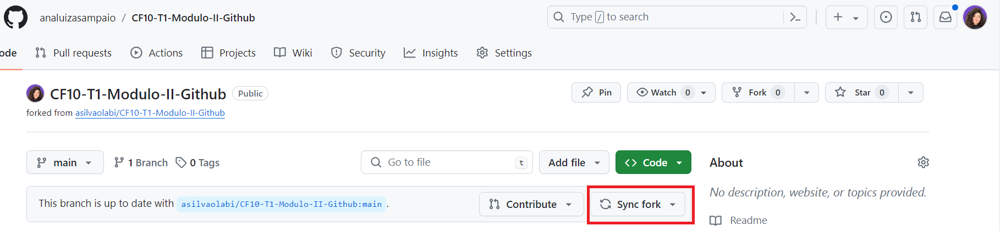

### Contribuindo com um projeto 


Quando compartilhamos o repositório da aula com vocês forken para o seus repositórios pessoais, criem uma branch com seu nome:

```bash
git checkout -b nome-da-sua-branch
```

Na sua branch coloque todas as suas mudanças e anotações, não esqueça de sempre subir seu código.

```bash
git add nome-do-arquivo
git commit -m "seu commit"
git push origin nome-da-sua-branch
```

**A professora atualizou o repositório dela mas o meu reposítório esta desatualidado, e agora?**

Entenda que quando forkamos um repositório temos duas origens de códico: o de origem (*upstream*), criada pela professora e a do seu github, com as suas modificações. O link que direciona para essas origens pode se chamado de *remote.*

Quando a professora colocar o conteúdo atualizado no repositório lembre-se: você deve atualizar também seu repositório forkado.

Pra atualizar seu repositório precisamos configurar os *remotes*. Então primeiro listamos os remotes configurados pra o seu fork:

```bash
git  remote -v
```

Esse comando vai retornar os links do seu repositório que foi forcado, não o original criado pela professora. Algo parecido com isso:

```bash
origin  https://github.com/SEU_USERNAME/SEU_FORK.git (fetch)
origin  https://github.com/SEU_USERNAME/SEU_FORK.git (push)
```

Para pegarmos as atualizações no repositório original, precisamos adicionar um novo remote direcionando para o repositorio da professora:

```bash
git remote add upstream LINK-DO-REPOSITORIO-RAIZ
```

Nessa aula, por exemplo, você faria algo assim:

```bash
git remote add upstream LINK REPOSITORIO RAIZ
```

Agora, se repetirmos o comando de verificação dos remotes, teremos o upstream listado:

```bash
git  remote -v

origin  https://github.com/SEU_USERNAME/SEU_FORK.git (fetch)
origin  https://github.com/SEU_USERNAME/SEU_FORK.git (push)
upstream  https://github.com/USERNAME_RAIZ__/REPOSITORIO_ORIGINAL.git (fetch)
upstream  https://github.com/USERNAME_RAIZ/REPOSITORIO_ORIGINAL.git (push)
```

O origin é o seu repositório, o upstream é o repositorio original. Dessa forma, para atualizar a main do seu repositório(origin) você deve baixar as atualização que estão no repositorio original (upstream) e subir para a sua main(origin).

Então primeiro devemos ir para a main

```bash
git checkout main
```

E então deverá fazer um pull na main do repositório original

```bash
git pull upstream main
```

e depois você deve dar push na sua main do seu repositório forcado:

```bash
git push origin main
```

Fazendo assim, sua main vai sempre estar com o código da professora, correções dos exercícios, etc e a sua branch fica com suas anotações e seus códigos.

Estou enviando **[aqui](https://jaimeneeves.medium.com/atualizando-seu-fork-do-github-1e2a78ee4cbf)** esse tutorial para quem quer configurar o seu remote local e fazer pulls.

O blog do [atlassian](https://www.atlassian.com/br/git/tutorials/syncing) tem um conteúdo legal sobre o git, mesmo sendo uma plataforma com o visual um pouco diferente do github que usamos, os comandos são os mesmos, então valem para as duas plataformas.

> Agora que você aprendeu tudo isso, o próprio github tem uma forma mais facil de se atualizar o fork,só clicar em `sync fork`😂

